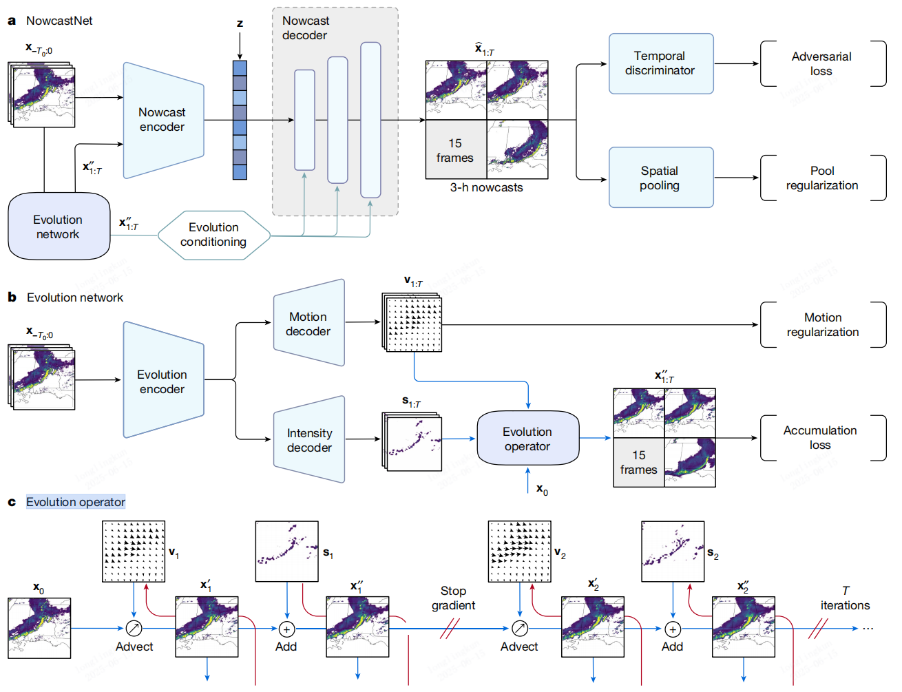
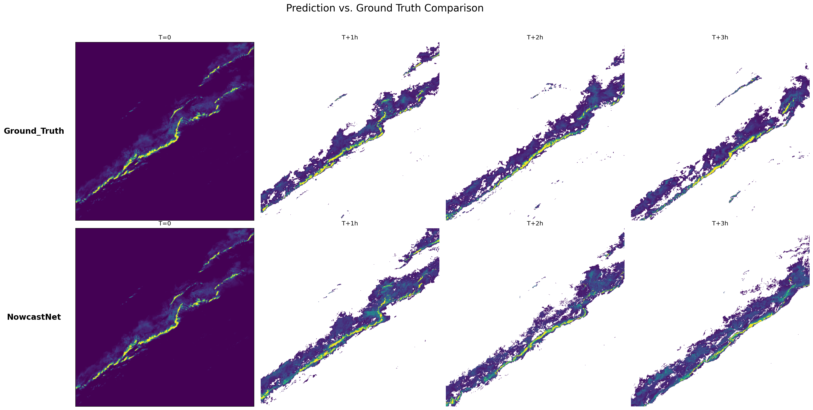
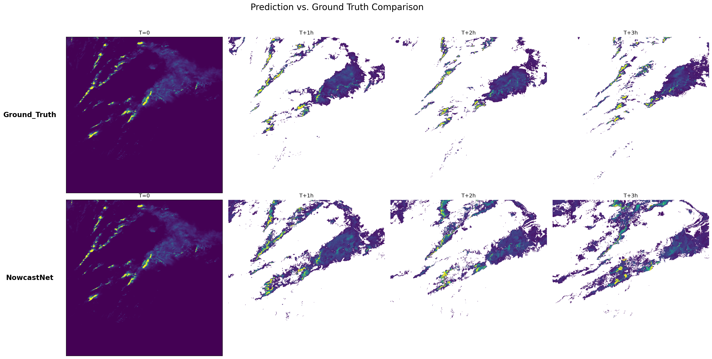
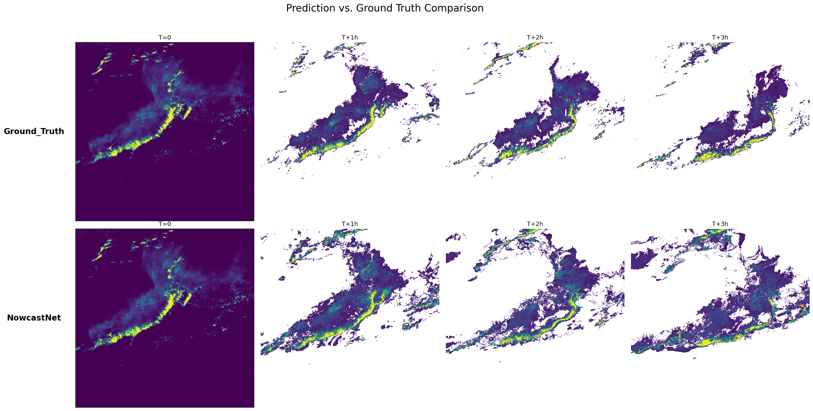
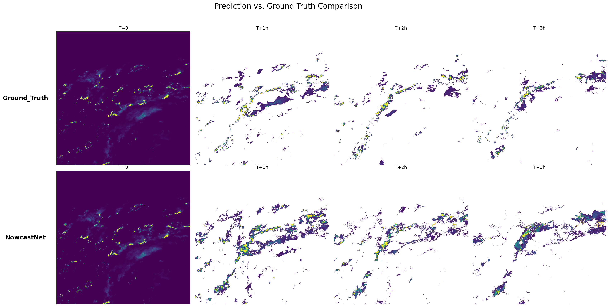
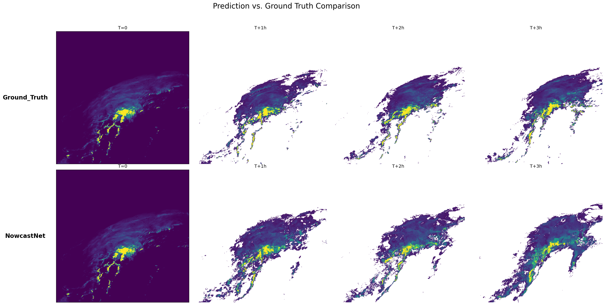
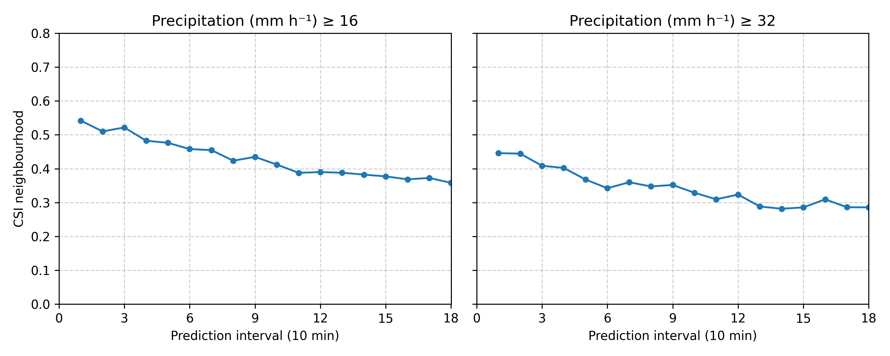
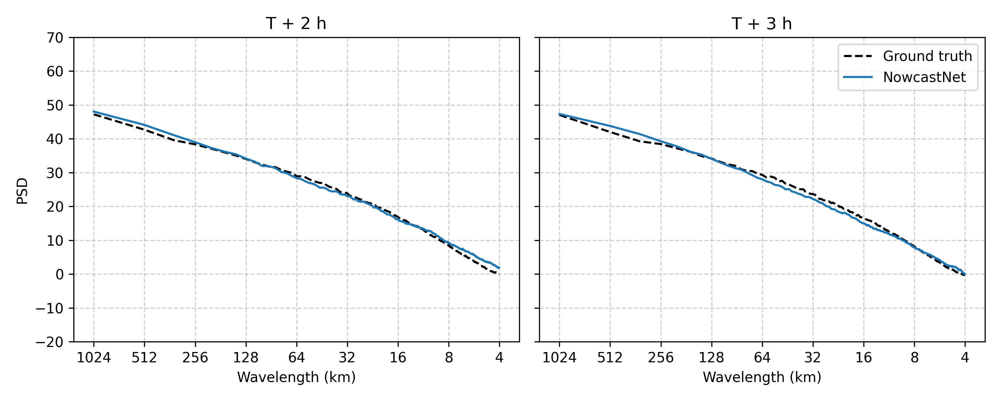

# NowcastNet: 极端降水临近预报 (PaddlePaddle 实现)

本仓库提供了 [NowcastNet](https://www.nature.com/articles/s41586-023-06184-4) 论文的 PaddlePaddle 实现，这是一个用于精准进行降水临近预报的深度学习模型。该模型将基于物理的演化方案与条件学习方法统一到一个神经网络框架中，能够对极端降水事件进行高分辨率、长时效的预报。


此实现基于 **PaddleScience (飞桨科学计算工具套件)** 构建。

代码开源仓库为[PaddleScience/examples/nowcastnet at develop · Longxmas/PaddleScience](https://github.com/Longxmas/PaddleScience/tree/develop/examples/nowcastnet)。

代码位于压缩包的examples/nowcastnet目录下。

## 项目结构

```
.
├── conf/                     # Hydra 配置文件
│   ├── nowcastnet.yaml       # 用于评估、导出和推理的配置
│   └── train.yaml            # 用于两阶段训练的配置
├── data/                     # 数据集占位符
│   └── radar_data/           # 示例：请将您的 .png 文件放在这里
├── loss.py                   # NowcastNet 的自定义损失函数
├── nowcastnet.py             # 用于评估、导出和推理的主脚本
├── merge_weights.py          # 用于合并两阶段训练的权重
├── nowcastnet_train.py       # 用于两阶段训练的主脚本
├── NowcastNet_Demo.ipynb     # 交互式演示和可视化 Notebook
├── evaluate.py               # 用于定量评估模型预测能力
└── README.md                 # 本说明文件
```

## 代码模块说明

### `nowcastnet_train.py`

这是训练 NowcastNet 模型的核心脚本。根据论文，训练过程分为两个截然不同的阶段：

1.  **演化网络训练 (Phase 1)**：此阶段训练包含物理信息的 `演化网络` (`evo_net`)。该网络基于物理定律（如连续性方程）学习预测降水模式的平流（运动）和强度变化。它会生成一个较为粗糙但物理上合理的预报。
2.  **生成网络训练 (Phase 2)**：在此阶段，预训练好的 `演化网络` 的权重将被**冻结**。然后，在一个 GAN (生成对抗网络) 的设定下，训练 `生成网络` (`gen_enc`, `gen_dec`) 和一个 `时间判别器` (`TemporalDiscriminator`)。生成器学习在演化网络输出的粗糙预报基础上，为其添加高分辨率的对流细节。

该脚本中使用的 `TemporalDiscriminator` 类是 GAN 的关键组成部分，用于区分真实的雷达图像序列和模型生成的序列。

### `loss.py`

该文件包含了训练 NowcastNet 所需的所有自定义损失函数，直接实现了论文中定义的目标函数：

-   `EvolutionAccumulationLoss`: 对应 `J_accum`，一个加权 L1 损失，用于惩罚预测帧（平流预测和演化预测）与真实情况之间的差异。
-   `EvolutionMotionLoss`: 对应 `J_motion`，一个正则化项，用于鼓励生成更平滑的运动场，并根据降水强度进行加权。
-   `EvolutionLoss`: 组合 `J_accum` 和 `J_motion`，构成演化网络的总损失。
-   `DiscriminatorLoss`: 标准的 GAN 判别器损失，促使判别器能正确分类真实和生成的序列。
-   `GeneratorAdversarialLoss`: 生成器的对抗损失，促使生成器能“欺骗”判别器。
-   `PoolRegularizationLoss`: 对应 `J_pool`，一个正则化项，通过在更粗糙的池化尺度上，强制要求集成预报结果与真实情况在空间上保持一致。
-   `GenerativeNetworkLoss`: 组合对抗损失和池化正则化损失，构成生成网络的总损失。

### `nowcastnet.py`

该脚本是所有**训练后**任务的主入口。它本身不执行训练。

-   `evaluate (mode=eval)`: 加载一个完整训练好的模型，在测试集上运行，并将可视化的预测结果保存为图片或 GIF。
-   `export (mode=export)`: 将 PaddlePaddle 的动态图模型转换为静态图推理格式 (`.pdmodel`, `.pdiparams`)，以便高效部署。
-   `inference (mode=infer)`: 使用导出的静态图模型对新数据进行快速推理。

---

## 环境准备

### 1. 安装依赖

请确保您已安装 Python 3.10+，并安装所需的三方库。强烈建议使用虚拟环境。

```bash
# 安装 PaddlePaddle GPU 版本, 或 CPU 版本
pip install paddlepaddle-gpu

# 安装 PaddleScience 及其他依赖
pip install ppsci hydra-core omegaconf
```

### 2. 准备数据集

模型期望输入 `.png` 格式的雷达数据。

- 创建一个数据目录，例如 `./data/radar_data`。
- 将您的雷达序列文件 (例如 `sample_001.png`, `sample_002.png`) 放入该目录。对于 NowcastNet，时间维度为 29 (10 帧输入 + 19 帧未来)，即每个样本对应29张图片。
- 更新配置文件 (`conf/train.yaml` 和 `conf/nowcastnet.yaml`) 中的数据集路径，使其指向您的数据目录。

### 3. 下载预训练模型 (可选)

如果您只想运行评估或演示 Notebook，您将需要完整训练好的模型权重。

- 创建一个输出目录：`mkdir -p output/checkpoints/final_model/`
- 下载预训练权重 (`model.pdparams`) 并将它们放入上述目录。
- 更新 `conf/nowcastnet.yaml` 中的 `pretrained_model_path`，使其指向正确的模型路径。

---

## 训练与评估流程

完整的流程包括配置模型、运行两阶段训练，并最终评估结果。

### 步骤 1: 配置

在开始之前，请检查并编辑 `conf/` 目录中的配置文件。

-   **`conf/train.yaml`**: 训练的主配置文件。
    -   `TRAIN.module_name`: 设置为 `evolution` 或 `generation` 来选择训练阶段。
    -   `TRAIN.TRAIN_DATA_PATH`: 指向您的训练数据集的路径。
    -   `TRAIN.evolution_checkpoint_path`: **对阶段二至关重要**。指向演化网络训练阶段产出的最佳检查点路径。
-   **`conf/nowcastnet.yaml`**: 评估的主配置文件。
    -   `EVAL.pretrained_model_path`: 指向 GAN 阶段产出的最终生成器模型 (`model_gen.pdparams`) 的路径。
    -   `LARGE_DATASET_PATH` / `NORMAL_DATASET_PATH`: 指向您的评估数据集的路径。

### 步骤 2: 训练演化网络 (阶段一)

运行训练脚本，并将 `module_name` 设置为 `evolution`。这将训练并保存演化网络的检查点到 `output/checkpoints_evo/` 目录。

```bash
python nowcastnet_train.py TRAIN.module_name=evolution
```

训练完成后，请确定最佳的检查点（例如 `output/checkpoints_evo/epoch_100/model.pdparams`）。

### 步骤 3: 训练生成网络 (阶段二)

1. **更新配置**: 打开 `conf/train.yaml` 文件，将 `TRAIN.evolution_checkpoint_path` 设置为步骤 2 中得到的最佳检查点路径。

   ```yaml
   # 在 conf/train.yaml 文件中
   TRAIN:
     evolution_checkpoint_path: "output/checkpoints_evo/epoch_100/model.pdparams" 
     # ... 其他参数
   ```

2. **运行训练**: 运行训练脚本，并将 `module_name` 设置为 `generation`。这将冻结演化网络，加载其权重，并开始训练生成器和判别器。最终模型将被保存在 `output/checkpoints_gan/` 目录。

```bash
python nowcastnet_train.py TRAIN.module_name=generation
```

### **步骤 4: 合并两阶段权重**

由于第二阶段训练时 `演化网络` (`evo_net`) 的权重是固定的，理论上最终模型 `evo_net` 的权重应该与第一阶段训练结束时的权重完全相同。为了确保用于评估的模型使用了最精确的、未经改变的 `evo_net` 权重，您可以运行 `merge_weights.py` 脚本。

该脚本会：

1.  加载第一阶段训练得到的最佳 `evo_net` 权重。
2.  加载第二阶段训练得到的 `生成网络` (`gen_net`) 权重。
3.  将两者合并成一个单一的、完整的模型权重文件 (`nowcastnet_final.pdparams`)。

**操作流程:**

1. 打开 `merge_weights.py` 文件。

2. 修改 `evo_stage_model_path` 和 `gan_stage_model_path` 两个变量，使其分别指向您在第一阶段和第二阶段训练得到的最佳模型权重文件。

3. 运行脚本：

   ```bash
   python merge_weights.py
   ```

   这将在 `final_model_for_eval/` 目录下生成合并后的权重文件。

在接下来的评估步骤中，请使用这个新生成的合并权重文件。

### 步骤 5: 可视化评估模型

1. **更新配置**: 打开 `conf/nowcastnet.yaml` 文件，将 `EVAL.pretrained_model_path` 指向步骤 4 中得到的最终模型权重文件。例如：

   ```yaml
   # 在 conf/nowcastnet.yaml 文件中
   EVAL:
     pretrained_model_path: "final_model_for_eval/nowcastnet_final.pdparams"
   ```

2. **运行可视化评估**:

```bash
python nowcastnet.py mode=eval
```

此命令将生成预测结果的可视化图像，并将其保存在配置中指定的 `output/` 目录中。

### 步骤6：**定量评估模型**

除了 `nowcastnet.py` 提供的定性可视化评估外，我们还提供了一个专门的定量评估脚本 `evaluate.py`。该脚本旨在复现论文中的关键性能指标，从数学上评估模型的预报能力。`evaluate.py` 脚本功能包括：

1.  **逐样本预测**：加载指定的测试数据集，并逐个样本通过已训练的 NowcastNet 模型进行推理，生成未来180分钟（18个步长）的降水预报。
2.  **定性图像生成**：为每个测试样本生成一张与论文风格一致的对比图，将模型在 T+1h, T+2h, T+3h 时刻的预测结果与真实观测（Ground Truth）并列展示。
3.  **邻域 CSI (Critical Success Index) 计算**：
    -   CSI 是衡量预报准确性的常用指标，但对微小的位置偏差很敏感。
    -   `邻域CSI` 通过在一个小的邻域窗口（如 5x5）内检查预报和观测是否都“命中”了降水阈值，从而对微小的空间位移具有更好的容忍度，更符合气象应用的实际需求。
    -   脚本会计算在不同降水阈值（如 16 mm/h 和 32 mm/h）下，未来18个时间步长的平均邻域CSI得分，并绘制出 CSI 随预报时效变化的曲线图。
4.  **功率谱密度 (Power Spectral Density, PSD) 分析**：
    -   PSD 用于衡量图像在不同空间尺度（波长）上的能量分布。在降水预报中，它能反映模型生成降水场的“真实感”和“清晰度”。
    -   一个好的模型应该能生成与真实观测具有相似 PSD 曲线的预报，这意味着它能准确地再现从小尺度对流细节到大尺度天气系统的结构特征。模糊的预报通常会在高频（小波长）部分能量不足。
    -   脚本会计算在 T+2h 和 T+3h 时刻，模型预测与真实观测的平均 PSD 曲线，并以对数-对数坐标图的形式进行对比。

#### 如何运行定量评估

1. **准备配置文件**：

   -   该脚本使用与 `nowcastnet.py` 相同的配置文件 `conf/nowcastnet.yaml`。
   -   请确保 `EVAL.pretrained_model_path` 指向您最终训练好的模型（或合并后的模型）。
   -   请确保 `NORMAL_DATASET_PATH` 或 `LARGE_DATASET_PATH` 指向您想要评估的测试数据集。

2. **运行脚本**：
   在终端中执行以下命令：

   ```bash
   python evaluate.py
   ```

3. **查看结果**：

   -   评估过程会比较耗时，因为它需要对测试集中的每个样本进行推理和计算。
   -   脚本运行结束后，所有生成的图像将被保存在配置文件中 `output_dir` 指定的目录下（例如 `output/normal_eval/`）。
   -   您会找到以下文件：
       -   `case_study_*.png`: 每个样本的定性对比图。
       -   `csi_evaluation.png`: 所有样本平均的邻域CSI曲线图。
       -   `psd_evaluation.png`: 所有样本平均的PSD曲线对比图。
   -   通过分析这些图表，您可以全面、定量地评估您的 NowcastNet 模型在不同强度、不同尺度和不同预报时效下的性能表现。

## 可视化结果











模型预测结果可视化动图：imgs/nowcastnet_pred.mp4

观测结果可视化动图：imgs/ground_truth.mp4
<video src="imgs/nowcastnet_pred.mp4"></video>


## 定量评估结果





## 交互式演示

如果您想查看如何加载已训练模型、进行预测并可视化结果的分步指南，请参考 **`NowcastNet_Demo.ipynb`** Notebook。